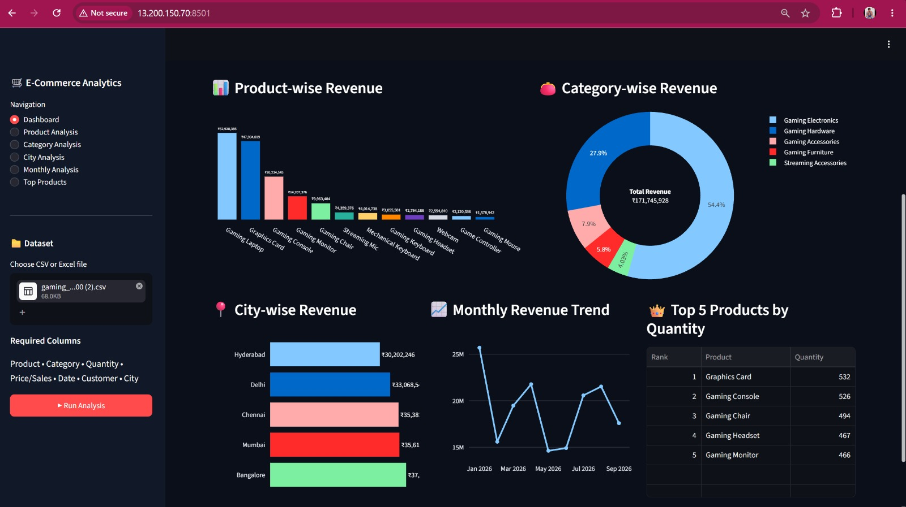

# ☁️ Cloud-Integrated E-Commerce Big Data Analytics

> An end-to-end Big Data Analytics project integrating AWS Cloud, Hadoop, MapReduce, and Streamlit for e-commerce sales analysis.

## 📌 Overview

This project demonstrates an end-to-end Big Data Analytics system for processing, analyzing, and visualizing e-commerce sales data.

The system integrates **Amazon S3**, **AWS EC2**, **Hadoop HDFS**, **YARN**, **Java MapReduce**, and **Streamlit** to create a complete cloud-based Big Data analytics pipeline.

Amazon S3 is used for cloud storage, AWS EC2 provides the cloud computing environment, Hadoop HDFS provides distributed storage, YARN manages processing resources, and Java MapReduce programs perform the required analytics.

The final analytical results are presented through an interactive Streamlit dashboard.

---

## 🎯 Objectives

- Store e-commerce datasets in Amazon S3.
- Use AWS EC2 as the cloud computing environment.
- Store datasets using Hadoop HDFS.
- Use YARN for resource management.
- Process datasets using Java MapReduce.
- Perform product-wise sales analysis.
- Perform category-wise sales analysis.
- Perform city-wise sales analysis.
- Analyze monthly sales trends.
- Identify top-selling products.
- Display analytical results through an interactive Streamlit dashboard.
- Demonstrate the integration of Cloud Computing and Big Data technologies.

---

## 🏗️ System Architecture

```text
                         ┌──────────────────┐
                         │       User       │
                         └────────┬─────────┘
                                  │
                                  ▼
                         ┌──────────────────┐
                         │    Streamlit     │
                         │    Dashboard     │
                         └────────┬─────────┘
                                  │
                                  ▼
                         ┌──────────────────┐
                         │    Amazon S3     │
                         │  Cloud Storage   │
                         └────────┬─────────┘
                                  │
                                  ▼
                         ┌──────────────────┐
                         │     AWS EC2      │
                         │  Ubuntu Server   │
                         └────────┬─────────┘
                                  │
                                  ▼
                         ┌──────────────────┐
                         │    Hadoop HDFS   │
                         │  Data Storage    │
                         └────────┬─────────┘
                                  │
                                  ▼
                         ┌──────────────────┐
                         │      YARN        │
                         │ Resource Manager │
                         └────────┬─────────┘
                                  │
                                  ▼
                    ┌──────────────────────────┐
                    │      Java MapReduce      │
                    ├──────────────────────────┤
                    │ Product Sales             │
                    │ Category Sales            │
                    │ City Sales                │
                    │ Monthly Sales             │
                    │ Top Products              │
                    └────────────┬─────────────┘
                                 │
                                 ▼
                         ┌──────────────────┐
                         │    Streamlit     │
                         │  Visualization   │
                         └──────────────────┘───────┘


## 📸 Project Screenshots

### 1. Streamlit Dashboard

The Streamlit dashboard provides the main interface for viewing e-commerce analytics and interactive visualizations.



---

### 2. AWS EC2 Instance

The project uses an AWS EC2 Ubuntu instance as the cloud computing environment.


---

### 3. Hadoop HDFS and YARN

Hadoop HDFS is used for distributed data storage, while YARN manages the resources required for processing.


---

### 4. MapReduce Results

The Java MapReduce programs process the e-commerce dataset and generate analytical results.


---

### 5. Amazon S3 Storage

Amazon S3 is used to store the e-commerce dataset in the cloud.

