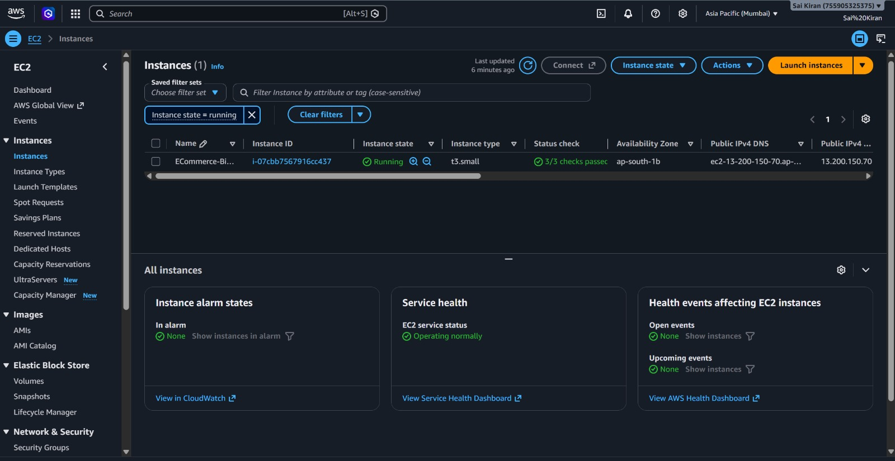
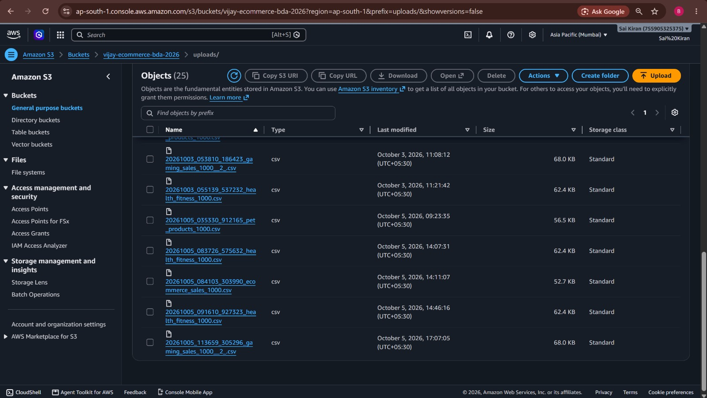
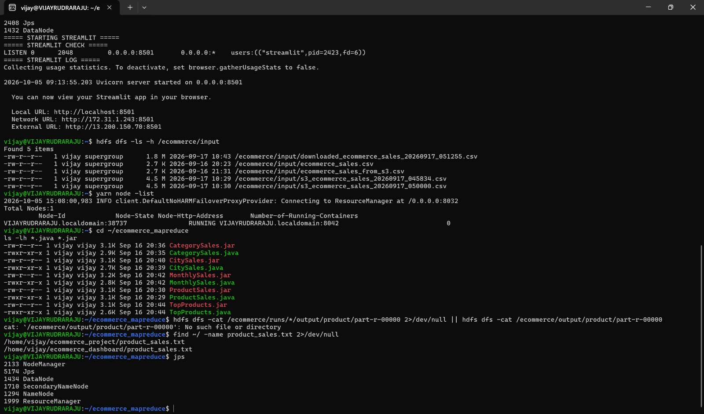
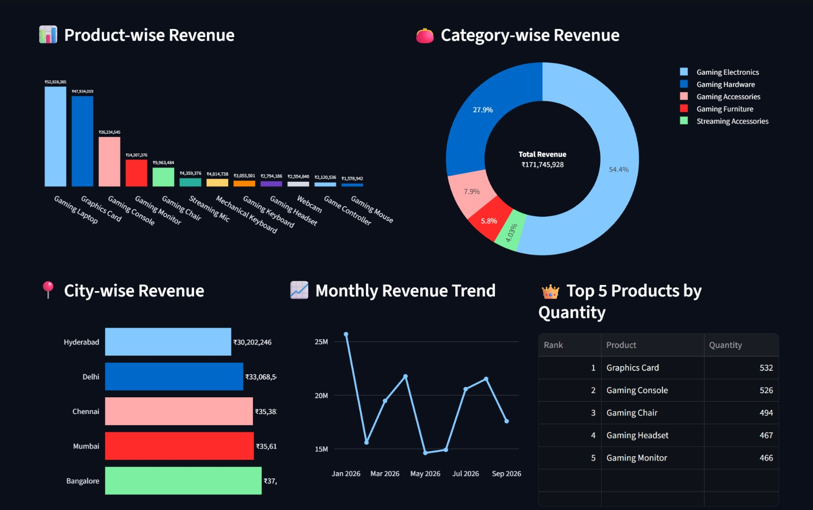

# ☁️ Cloud-Integrated E-Commerce Big Data Analytics

> An end-to-end Big Data Analytics project integrating **AWS Cloud, Hadoop, MapReduce, and Streamlit** for e-commerce sales analysis.

## 📌 Overview

This project demonstrates how e-commerce sales data can be stored in the cloud, processed using Hadoop MapReduce, and presented through an interactive web dashboard.

The application uses **Amazon S3** for cloud storage and **AWS EC2** as the processing and deployment environment. Hadoop **HDFS** stores the dataset, **YARN** manages the processing resources, and five Java **MapReduce** programs perform the required analytics.

The final results are displayed through a **Streamlit dashboard**.

---

## 🏗️ System Architecture

```text
                    ┌──────────────┐
                    │     User     │
                    └──────┬───────┘
                           │
                           ▼
                 ┌──────────────────┐
                 │    Streamlit     │
                 │    Dashboard     │
                 └────────┬─────────┘
                          │
                          ▼
                 ┌──────────────────┐
                 │    Amazon S3     │
                 │  Cloud Storage   │
                 └────────┬─────────┘
                          │
                          ▼
                 ┌──────────────────┐
                 │     AWS EC2      │
                 │  Ubuntu Server   │
                 └────────┬─────────┘
                          │
                          ▼
                 ┌──────────────────┐
                 │    Hadoop HDFS   │
                 │  Data Storage    │
                 └────────┬─────────┘
                          │
                          ▼
                 ┌──────────────────┐
                 │      YARN        │
                 │ Resource Manager │
                 └────────┬─────────┘
                          │
                          ▼
              ┌─────────────────────────┐
              │    Java MapReduce       │
              ├─────────────────────────┤
              │ Product Sales           │
              │ Category Sales          │
              │ City Sales              │
              │ Monthly Sales           │
              │ Top Products            │
              └────────────┬────────────┘
                           │
                           ▼
                 ┌──────────────────┐
                 │    Streamlit     │
                 │  Visualization   │
                 └──────────────────┘


## 📸 Project Screenshots

### 1. Streamlit Dashboard

The Streamlit dashboard provides the interface for uploading the e-commerce dataset, running the analysis, and viewing the results.

<p align="center">
  
</p>

---

### 2. AWS EC2 Instance

The project is deployed on an AWS EC2 Ubuntu instance. EC2 provides the cloud computing environment where Hadoop, MapReduce, and Streamlit run.

<p align="center">
  
</p>

---

### 3. Amazon S3 Storage

Amazon S3 is used to store the uploaded e-commerce dataset in the cloud before processing.

<p align="center">
  
</p>

---

### 4. Hadoop HDFS and YARN

Hadoop HDFS stores the dataset for processing, while YARN manages the resources required for MapReduce execution.

<p align="center">
  
</p>

---

### 5. MapReduce Results

Five Java MapReduce programs are used for product-wise, category-wise, city-wise, monthly, and top-product analysis.

<p align="center">
  
</p>